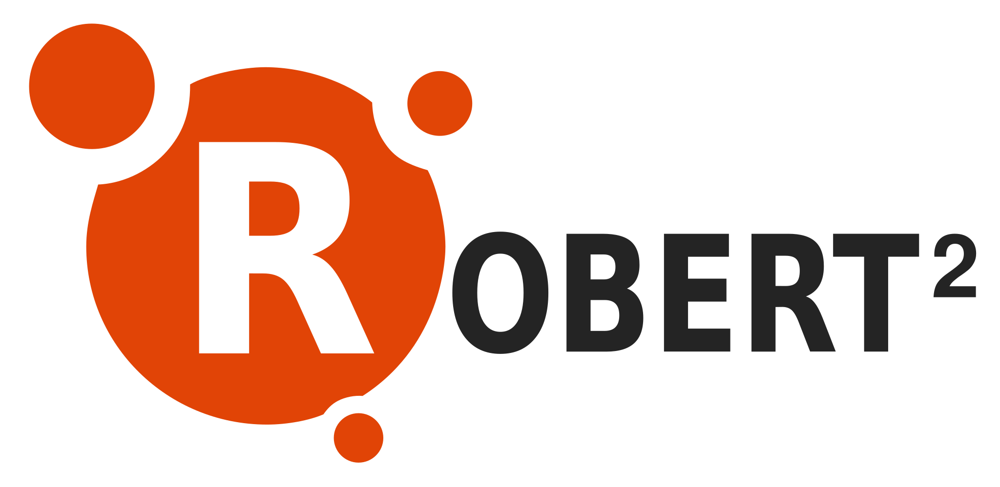

    
    

        Application de <strong>gestion de location de matériel</strong> simple, efficace, modulable et open-source.
          
        <a href="https://robertmanager.org">Site officiel</a> | <a href="https://forum.robertmanager.org">Forum</a> | <a href="https://newsletter.robertmanager.org/abo.php">Abonnement à la newsletter</a>
    

### Robert2, c'est pour qui ?

Si vous êtes une association, une institution, une école ou université, une entreprise ou même un petit entrepreneur, et que vous avez du matériel à louer ou à prêter, Robert2 est fait pour vous.  
Il vous aidera à gérer votre parc de matériel, vos prestations, événements, bénéficiaires et techniciens.

### Robert2, comment ça marche ?

Sur votre ordinateur, tablette ou smartphone, vous vous connectez à Robert2 grâce à un navigateur web, comme Firefox, Chrome, Opera ou Edge, en visitant simplement l'adresse sur laquelle il est installé.

Une fois entré dans l'application, vous pouvez l'utiliser !

## Fonctionnalités

### Calendrier

Clair, pratique et réactif : Visualisation des événements sur une frise temporelle, pour tout voir en un coup d'oeil.

### Parcs de matériel

Gestion du stock : Plusieurs parcs de matériel, catégories libres, caractéristiques personnalisées, gestion des pannes...

### Bénéficiaires

Gestion des clients : Liste des particuliers, entreprises ou associations qui bénéficient de vos services.

### Événements

Gestion des événements : Assignation de listes de matériel et de techniciens à des périodes de temps. Sous-totaux par catégorie, et affichage du matériel manquant dans la période donnée.

### Techniciens

Gestion du personnel : Gestion des personnes (techniciens) qui peuvent être assignées à des événements.

### Devis & Factures

Édition simple et rapide : Création et impression facile de vos factures et devis au format PDF.

### Facile à installer

Robert2 est écrit en PHP et Javascript, et utilise une base de données MySQL. Cela lui permet d'être installé sur la plupart des serveurs, même les moins puissants ! De plus, un assistant d'installation vous aide lors de vos premiers pas.

### Accessible partout

Une fois l'application installée sur votre serveur, vous pouvez l'utiliser depuis n'importe où via internet, et un navigateur web, sur votre ordinateur, tablette ou même votre smartphone !

### Contributeurs

Robert2 est maintenu par __Paul Maillardet (Polosson)__ ainsi que __Donovan Lambert__.   
Le projet est soutenu par __[Pulsanova](https://pulsanova.com)__, des artisans développeurs orientés qualité et expérience utilisateur.

## Licence

Cette application web est distribuée dans l'espoir qu'elle soit utile, mais SANS AUCUNE GARANTIE.

Robert2 est modifiable et redistribuable sous les termes de la [Licence Creative Commons BY-NC-SA 4.0](https://creativecommons.org/licenses/by-nc-sa/4.0/deed.fr). Elle es utilisable, modifiable et redistribuable dans le cadre de l'usage privé ou personnel. Aucune utilisation commerciale du **code source** de l'application ne peut en être faite (pas de distribution du code source en tant que service commercial).

Pour plus de détails, voir le fichier [LICENCE.md](/LICENCE.md) à la racine du projet.
